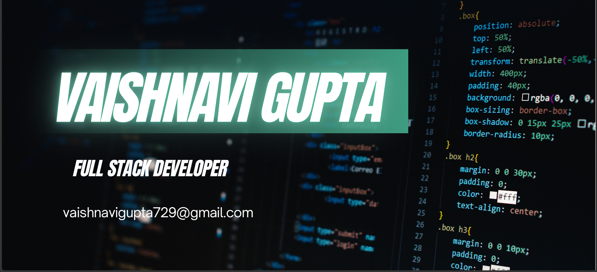

  

<h1 align="center">Hi 👋, I'm Vaishnavi Gupta</h1>
<h3 align="center">
💻 Full Stack Developer | MERN Stack  
Building modern, scalable, and responsive web applications with clean code and great user experience. 
Always learning new technologies and turning ideas into impactful digital products.
</h3>

### 🧠 About Me  
- 🎓 Computer Science graduate passionate about Full Stack Web Development.
- 💻 Building projects using React.js, Next.js, Node.js, Express.js, MongoDB, MySQL, and TypeScript.
- 🌱 Currently learning advanced concepts in Next.js, AWS, and AI integration.
- 🚀 Interested in Full Stack, Frontend, Backend, and MERN Stack Development.
- 📧 Reach me at: vaishnavigupta729@gmail.com .
- ⚡ Fun fact: I enjoy solving real-world problems by building practical and user-friendly web applications.
  
### 🛠️ Skills  

#### 💻 Frontend Development  
- **Next.js 15**, **React.js**, **JavaScript (ES6+)**, **TypeScript**, **Redux Toolkit**, **HTML5**, **CSS3**, **Tailwind CSS**, **Material UI (MUI)**, **Media Queries**, **Responsive Design**,
#### ⚙️ Backend Development  
- **Node.js**, **Express.js**,  **RESTful APIs**, **Authentication & Authorization (JWT, OAuth)**, **CRUD Operations**, **Socket.io**, **Error Handling**, **API Integration**,**Webhooks**
#### 🧩 Database & Cloud  
- **MongoDB**, **MySQL**, **Database Indexing**, **Query Optimization**, **Scalable Schema Design**
#### 🧰 Tools & General Development  
- **Vs Code**,**Git & GitHub**, **Postman**, **Vercel**,**ImageKit**, 
---
### ⚙️ Tech Stack  

  
  
  
  
  
  
  
  
  
  
  
 

---

### 🤝 Connect with Me  

  
  

---

  <b>✨ “Code. Create. Collaborate. Evolve.” ✨</b>

